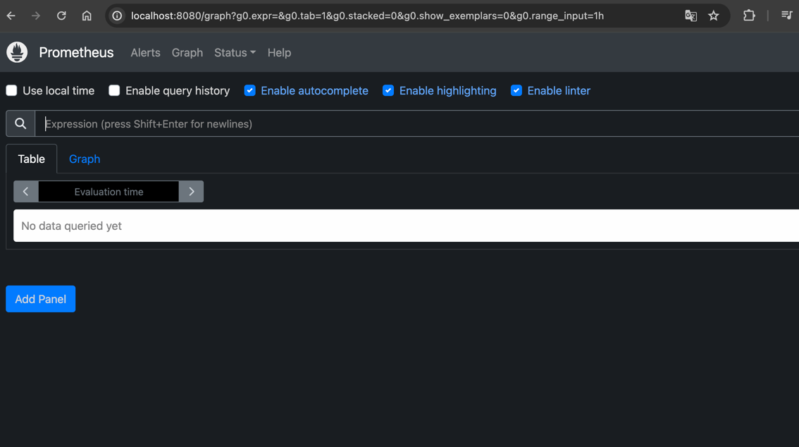
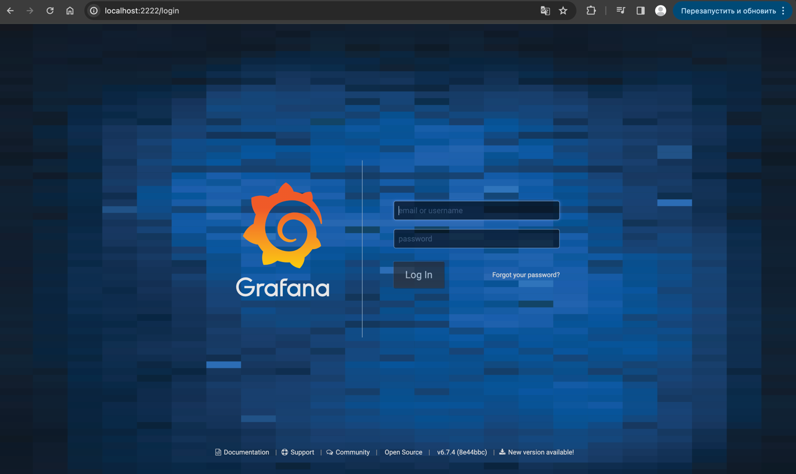
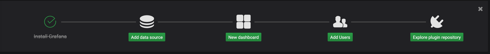
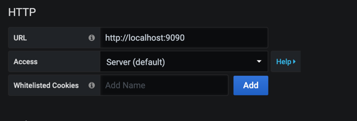
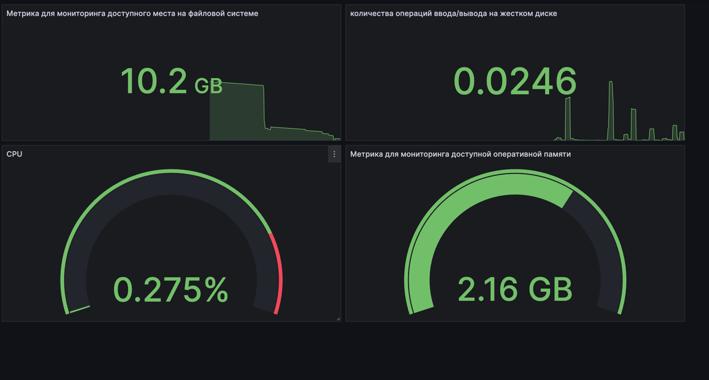
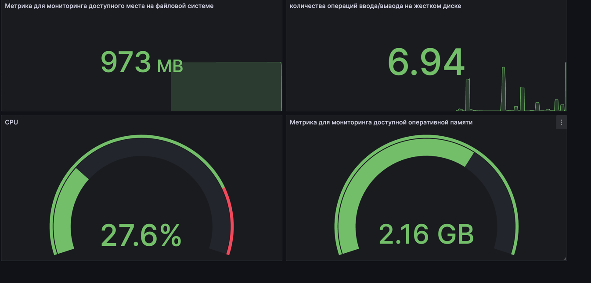
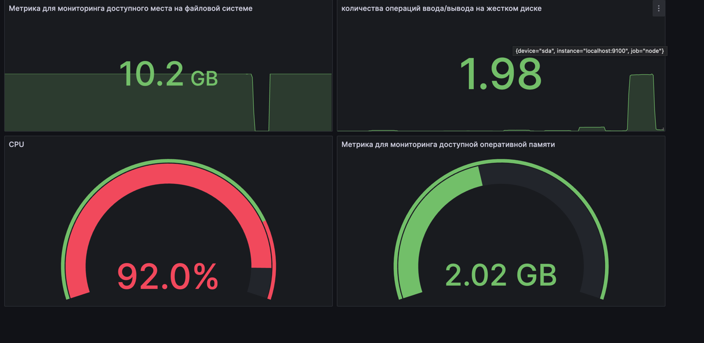

* Ввести логин и пароль   `admin`<br/>

* Выбрать "Add source data"

* Выбрать  "Prometheus"

*  Ввести в поле URL "http://localhost:9090"

* Сохранить изменения ≠

## Настройка  Prometheus и Grafana

* Скачать Node Exporter
```
wget https://github.com/prometheus/node_exporter/releases/download/v1.3.1/node_exporter-1.3.1.linux-amd64.tar.gz
```

* Распаковать архив:
``` 
tar xvf node_exporter-1.3.1.linux-amd64.tar.gz
```
* Переместить бинарный файл:
```
cd node_exporter-1.3.1.linux-amd64
sudo cp node_exporter /usr/local/bin
```

* Создать пользователя Node Exporter
```
sudo useradd --no-create-home --shell /bin/false node_exporter
sudo chown node_exporter:node_exporter /usr/local/bin/node_exporter
```

* Создать и запустить службу Node Exporter:
```
sudo vim /etc/systemd/system/node_exporter.service
```
```
[Unit]
Description=Node Exporter
Wants=network-online.target
After=network-online.target

[Service]
User=node_exporter
Group=node_exporter
Type=simple
ExecStart=/usr/local/bin/node_exporter
Restart=always
RestartSec=3

[Install]
WantedBy=multi-user.target
```

* Перезагрузить systemd
```
sudo systemctl daemon-reload
```

* Включить службу, чтобы она автоматически запускалась при старте системы:
```
sudo systemctl enable node_exporter.service
```
* Запустить службу:
```
sudo systemctl status node_exporter.service
```

* Открыть доступ к порту 9100
```
sudo ufw allow 9100
```
* Разрешить входящий трафик на порту 9100

```
sudo iptables -I INPUT -p tcp -m tcp --dport 9100 -j ACCEPT
```

* Добавить цель для сбора метрик от Node Exporter в Prometheus:

```
sudo vim /etc/prometheus/prometheus.yml
```

```# my global config
global:
  scrape_interval: 15s  # Set the scrape interval to every 15 seconds. Default is every 1 minute.
  evaluation_interval: 15s  # Evaluate rules every 15 seconds. The default is every 1 minute.
  # scrape_timeout is set to the global default (10s).

# Alertmanager configuration
alerting:
  alertmanagers:
    - static_configs:
        - targets:
          # - alertmanager:9093

# Load rules once and periodically evaluate them according to the global 'evaluation_interval'.
rule_files:
  # - "first_rules.yml"
  # - "second_rules.yml"

# A scrape configuration containing exactly one endpoint to scrape:
# Here it's Prometheus itself.
scrape_configs:
  # The job name is added as a label `job=<job_name>` to any timeseries scraped from this config.
  - job_name: "prometheus"
    
    # metrics_path defaults to '/metrics'
    # scheme defaults to 'http'.

    static_configs:
      - targets: ["localhost:9090"]

  - job_name: node
    static_configs:
      - targets: ["localhost:9100"]
 ```

* Перезапустить службу Prometheus

```
sudo systemctl restart prometheus
```

* Зайти в Grafana  и настроить дашборд при помощи метрик 

* Метрика для мониторинга операций ввода/вывода на жёстком диске:
``` 
rate(node_disk_reads_completed_total{instance="localhost:9100", device="sda"}[5m]) 
```
* Метрика для мониторинга использования ЦПУ:
```
100 - (avg by (instance)(irate(node_cpu_seconds_total{instance="localhost:9100",mode="idle"}[5m]))) * 100
```
* Метрика для мониторинга доступной оперативной памяти:

``` 
node_memory_MemAvailable_bytes{instance="localhost:9100"} / 1024 / 1024 / 1024
```

* Метрика для мониторинга доступного места на файловой системе:

``` 
node_filesystem_avail_bytes{instance="localhost:9100", mountpoint="/"} / 1024 / 1024 / 1024
```

* Готовый дашборд


* Запустим скрипт из 2 части и посмотрим, как изменились показатели 


* Заупстим stress -c 2 -i 1 -m 1 --vm-bytes 32M -t 10s и посмотрим изменения
