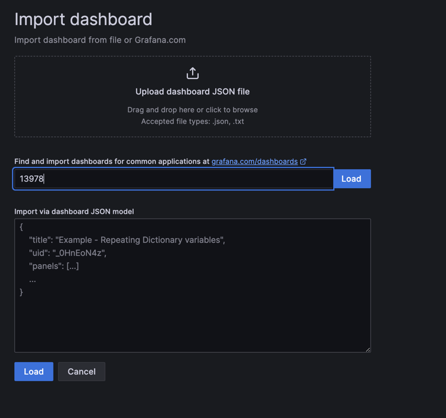
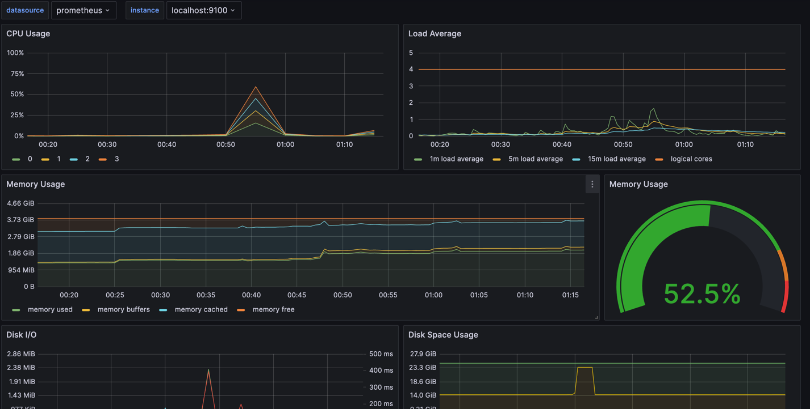
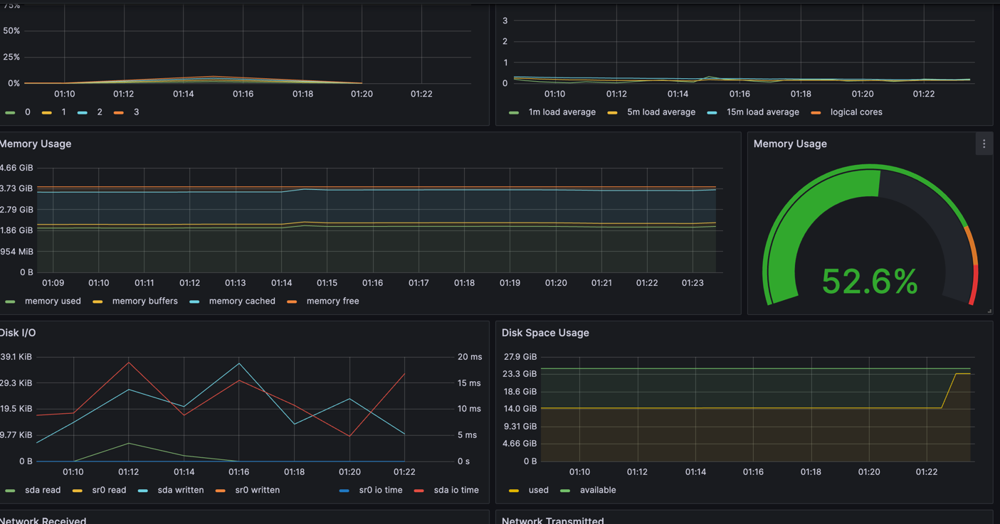
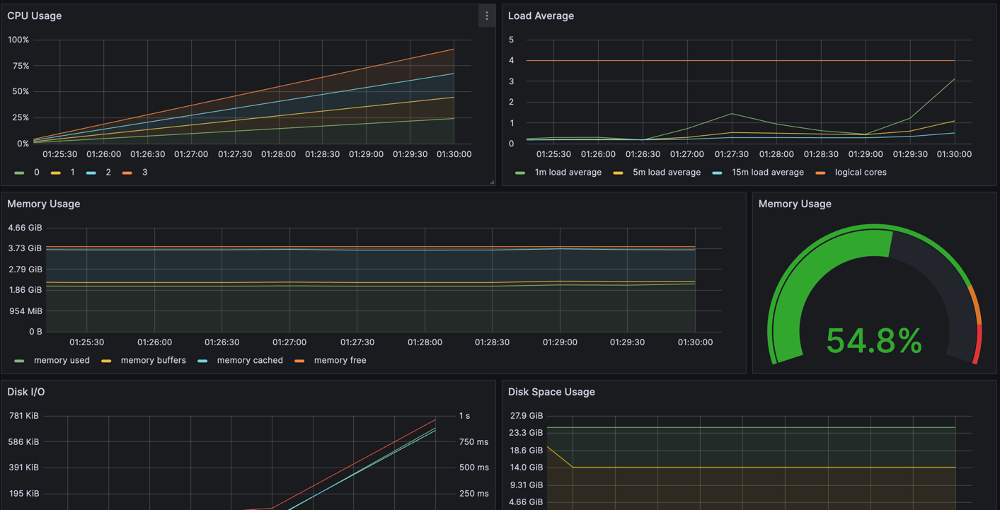
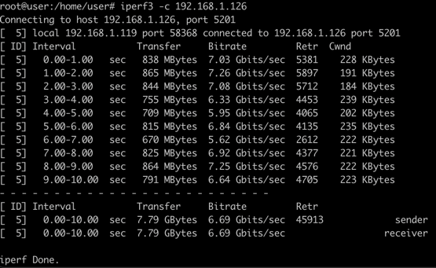
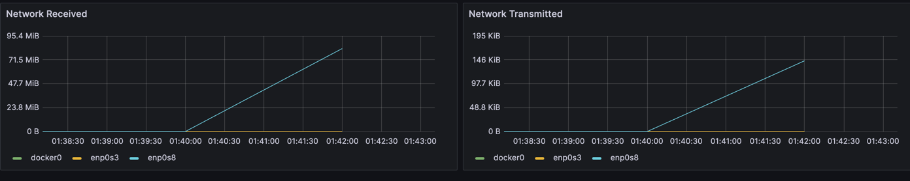

* Импортруем готовый дашборд  `Node Exporter Quickstart and Dashboard ` 
для этого просто введем id дашборда или использовай json файл 

* Теперь запустим скрипт из части 2 

Видно как график используемой памяти ушел вверх 

* Теперь запустим стрестест 

* Запустим `iperf3 -c 192.168.1.126 `  и посмотрим как изменились графики сетевых интерфейсов 

