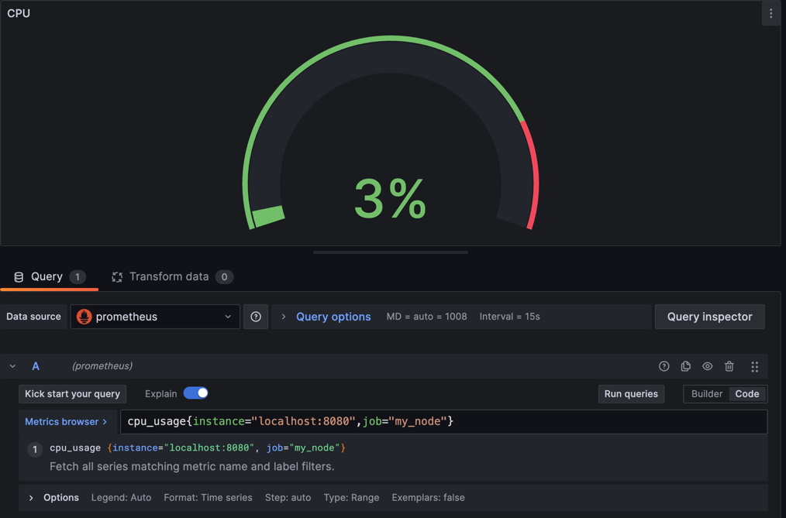

* 

* Проверим что prometheus получает метрики от nginx

* Настроить панель "Доступная оператиная память"

* Настроить панель "Доступная память жесткого диска"

* Настроить панель "CPU"

* Итоговый результат

* Теперь запустим скрипт из части 2 

* Очистим систему при помощи скриптов из части 3 и запустим стресс тест 

